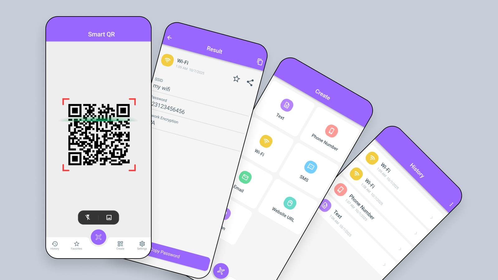

# Smart QR

**Smart QR** is a fast, lightweight Flutter app for scanning and generating QR codes and barcodes. Whether you're scanning product codes, creating a QR for a website or contact info, or saving scan history, Smart QR makes it simple and reliable.



---

## ✨ Features

- **QR & Barcode Scanning**  
  Quickly scan a wide variety of QR codes and barcodes with your device camera.

- **Generate QR Codes**  
  Create custom QR codes for URLs, text, contacts, phone numbers, and more.

- **Image Picker Support**  
  Scan codes directly from your gallery using built-in image selection.

- **Scan History**  
  All scanned codes are saved locally using Hive, with options to copy, share, or delete.

- **Save to Gallery**  
  Save generated QR codes directly to your device gallery.

- **Dark Mode Ready**  
  Designed to work smoothly in both light and dark themes.

---

## 🛠 Tech Stack

- **Flutter SDK**
- **State Management:** Riverpod
- **Local Storage:** Hive
- **Camera & Scanning:** `scan`, `images_picker`
- **QR Generation:** `qr_flutter`
- **File Handling & Sharing:** `gallery_saver`, `share_plus`, `url_launcher`

---

## 🚀 Getting Started

To run the app locally:

```bash
flutter pub get
flutter run
```

---

## 👨‍💻 Role

This project was fully developed by **Hasan Mahmud** as a solo developer.

---

## 📬 Contact

If you’re a recruiter or hiring manager and want to learn more, feel free to reach out:

**hasansujon786@gmail.com**
